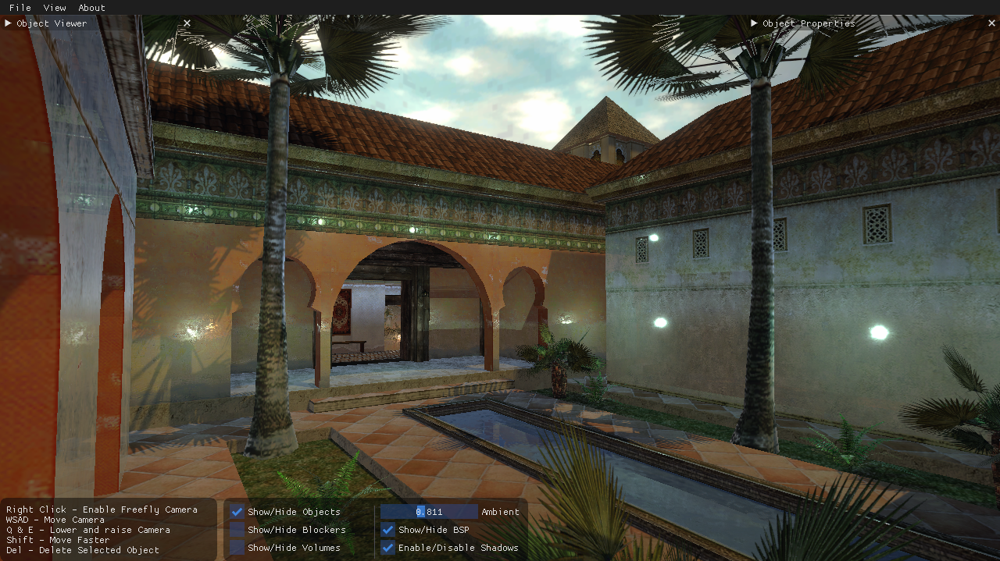
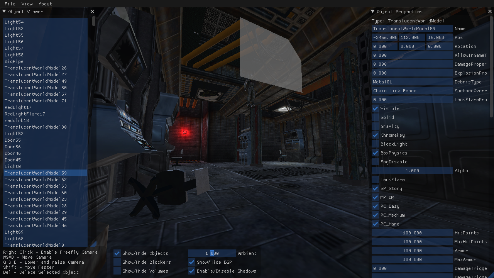

# DAT-Reader
Lithtech DAT World Viewer

## **Overview**
* It can display a .DAT file from AVP2 and NOLF (more planned).
* Export to OBJ (Entire level, or selected objects).
* Loads DTX Textures into Unity natively!
* Ability to hide and unhide the BSP, blockers, and volumes.
* Realtime light preview with shadows
* Object placement.
* Preliminary object editing.

## **TODO**
* Saving changes back to .DAT
* Weapon/Item placement for NOLF
* Support more games

